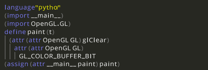
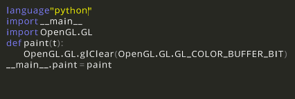

# Structure Editor, for .t+ -files.

If you decide to try it, make sure you've got pysdl2, pysdl2 image, pyopengl and textended. I've tried it with python 2.7

On ubuntu the dependencies can be satisfied with:

    sudo apt-get install python-opengl libsdl2-2.0-0 libsdl2-image-2.0-0
    sudo pip install pysdl2

You can obtain textended by:

    git clone https://github.com/cheery/textended/

It's just a module in a different repository so it's enough if you place the cloned directory inside the editor's repository.

On Windows platform you might not find SDL2_image. It is available in: https://www.libsdl.org/projects/SDL_image/ Place it into the PYSDL2_DLL_PATH.

The editor is implemented as a python script `edit.py`. It doesn't run without an argument. You can pass it any file ending with `.t+`. Many files are in outdated format, but all of them should open. Here's an example command that should run:

    python edit.py samples/distracted_99_bottles.t+

Specification:

 * [Draft of the specification](https://docs.google.com/document/d/11IUQ77CNGlKYNRPlC2a9ZDM6PqHlUvd4R5-ugqcIbnM/edit?usp=sharing)

Related blog posts: 

 * http://boxbase.org/entries/2014/dec/29/first-editor-release/
 * http://boxbase.org/entries/2015/jan/19/textended-layout-engine/
 * http://boxbase.org/entries/2015/feb/2/bottom-up-down-dissonance/
 * http://boxbase.org/entries/2015/feb/9/textended-schema/
 * http://boxbase.org/entries/2015/feb/16/projectional-repl/
 * http://boxbase.org/entries/2015/feb/23/why-cfg-as-schema/

There's an IRC channel #essence in irc.freenode.net, for those who like to discuss about visual programming/structured editing.

## Screenshots

Here's a screenshot from `samples/clearscreen.t+`, first with default layouting...

Next with python layouting...

Compiler and layouter are using similar matching rules. The rules in `extensions/python/__init__.py` were initially copied from `treepython.py`.
